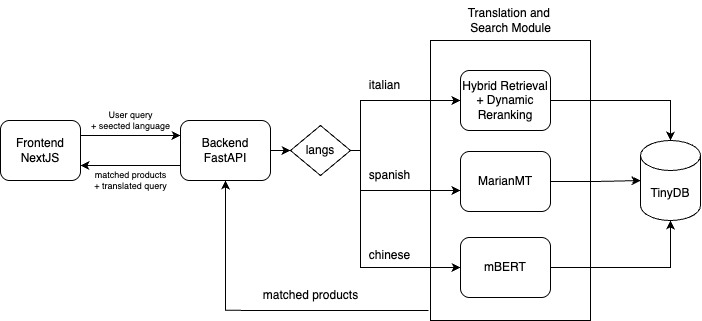

# EE6405C22

## **Easy Shop: Easy Buy – Easy Go**  
Repo for NLP EE6405 group C22  

**Members:**  
- Charran Senthil Kumar (Hybrid Retrieval)  
- Cheryl Lynn Kosasih (Hybrid Retrieval)  
- Liu Runlin (mBART)  
- Nguyen Minh Duc (Demo Web App)  
- Sanjay Aravin Murugan (MarianMT)

---

## A. Run the Frontend (Next.js)

```bash
cd frontend
npm install
npm run dev
```

The UI is hosted at: [http://localhost:3000](http://localhost:3000)

Notes: 
- The backend might take a while to run, so do not try to press "Search" button continuosly.
- To perform search for another product effectively, user should go back to the main page (by clicking the E-Shop icon at the top left), enter the query and select the language.
-  Images are used as a placehoders. Some products do not have images.

---

## B. Run the Backend (FastAPI)

1. Create and activate a Python virtual environment

2. Install dependencies:

```bash
pip install -r requirements.txt
```

3. Start the backend server:

```bash
cd backend
uvicorn main:app --reload
```

The backend is hosted at: [http://localhost:8000](http://localhost:8000)

---

## C. API Documentation

### 1. GET `/search`

#### Query Parameters:
- `q` (string): Search query (e.g., `"mouth spray"`)
- `langs` (string, optional): Comma-separated list of languages, e.g., `"Chinese,Spanish"`

#### Example:

```http
GET /search?q=mouth spray&langs=Chinese,Spanish,Italian
```

#### Sample Response:

```json
{
  "translations": {
    "Chinese": "口腔喷雾",
    "Spanish": "spray oral",
    "Italian": "spray orale"
  },
  "products": [
    {
      "id": 1,
      "name": {
        "en": "Mouth Spray",
        "zh": "口腔喷雾"
      },
      "description": {
        "en": "Freshens breath"
      }
    }
  ]
}
```

---

### 2. GET `/product/{id}`

#### Path Parameter:
- `id` (int): Product ID (e.g., `1`)

#### Example:

```http
GET /product/1
```

Returns the product details, or a 404 if not found.

---

## D. Tech Stack Overview



🛠 **Tech Stack**  
- **Frontend**: Next.js App Router  
- **Backend**: FastAPI  
- **Database**: TinyDB (`products.json`)  
- **Languages Supported and Model Used**:  
  - **Chinese** – mBART  
  - **Spanish** – MarianMT  
  - **Italian** – Hybrid Retrieval  
(Note: Each of these model can be run in all other language. However, for learning purpose, each model is implemented for a language. Refer to part E For detail research and run the demo on these models)
---

## E. Backend Models

### Hybrid Retrieval (Semantic Search)

**Location**: `notebook/hybrid retrieval + dynamic alpha`

Featuring:
- Hybrid Retrieval
- Dynamic Alpha Tuning / LLM Reranking

For detailed guide, refer to `Hybrid_Retrieval_Guide.md`

---

### Marian MT

**Location**: `notebook/MarianMT`

Featuring:
- HuggingFace MarianMT model  
- Hybrid retrieval using token and fuzzy matching  

**Algorithm Variants**:
- M3: Base version with multilingual translation  
- M4: Loop initialized  
- M5: Fine-tuned with evaluation (Spanish)  
- M6: DeepSeek & OpenAI integration  

> Use the `requirements.txt` to install relevant dependencies.

---

### mBART

**Location**: `notebook/MT/mBART/`

Implementation includes:
- Query expansion  
- mBART translation  
- Hybrid search  

> For documentation, refer to `doc.ipynb` (includes evaluation metrics).  
> **Note:** mBART model is large – download it from [Google Drive](https://drive.google.com/file/d/1mtvr1KcmOcw_8Pua-5OOqtou11ZypMu6/view?usp=sharing) and place it in `backend/mBART`.  
> **Note:** DeepSeek (free version) has a rate limit tied to the API key.

---

